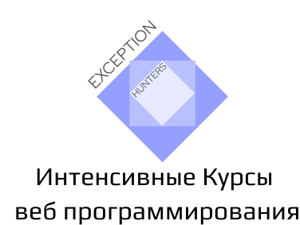

  

# Что будем делать сегодня (17 июль 2020)
1) Начнем основательно изучать Git, будет оооочень много практики. Но, все нужное и основное(и на самом деле не много)
2) Анализ макета "Super Host"
3) Если успеем, начнем верстать макет "Super Host"
4) Pixel Perfect 

# Что не успели пройти в прошлом уроке(долги)
1) rgb, rgba (альфа канал, 16-тиричная система)

# Что сделали(Что успели)
1) Хорошо потренировали Git
2) Анализ макета "Super Host"
3) Начали верстать макет "Super Host"

# Ключевые моменты урока
1) Прежде чем приступать к верстке макета то прежде создаем проект со следующей структурой
  <pre>
  Имя проекта (папка) -|
                       | -  сss (папка)
                       | -  js (папка)
                       | -  images(папка)
                       | -  index.html (файл)
  </pre>
              
              
2) Перед версткой нужно просмотреть макет и извлечь все картинки
3) Далее просмотреть все шрифты и найти их на сервисе  https://fonts.google.com/
4) В каждой странице можно выделить основные блоки - секции. На страницах как правило выделяются следующие секции
    * Введение(Кто мы)
    * Чем мы занимаемся
    * Почему мы лучшие
    * Отзывы клиентов
    * Напишите нам
    * Наши товары
    * Наша команда  
Секция это отдельный законченный блок информации. Секции можно сравнить с параграфом в тексте - текст делится на параграфы, каждый параграф рассказывает о своей части, но все они составляют из себя единый текст.
5) В HTML5 появился новый тег section. По сути это тот же тег div просто вместо div стоит section. Ни чего не изменится если section заменить на div и наоборот. Мы же будем всегда использовать тег section для верстки секции.
6) Вся верстка должна быть отцентрированна в определенном месте экрана. Для этого будем создавать контейнер с классом   
  <pre>
  .container {
    max-width: 1440px;
    margin: 0 auto;
    padding: 0 10px;
  }
  </pre>
  Блок с классом .container будем называть главным центрирующим контейнером  
 7) Обязательно скачиваем normalize.css и прописываем link в шапке index.html. Данный link должен быть выше всех других link'ов. Почему так - узнаем позже.
    
# Вопросы студента
# Вопрос: 
Используется ли где-то еще HTML кроме как в браузере?
# Ответ:
Нет, HTML использыуется только для вебразработки и рендериться браузером. Но!!! Сам HTML это XML, а XML раньше активно использовался для передачи данных. Сейчас же вместо XML спользуется JSON, кроме каких-то очень старых проектов.

  
  
  
  
  

